# Security Capture The Flag <small>CTF 101</small>

Welcome to the Security CTF 101 worklab, sponsored by Amazon Web Services Security.  In this worklab, you will work through a CTF challenge.  This worklab is built on the Mr. Robot CTF/Alternative Reality Game hosted at vulnhub.  Mr. Robot is a television show about a hacker- and the CTF is themed based on exploits the hacker ran in the Television program.  This CTF was created by Leon Johnson.  You can download the VM associated with this CTF <a href="https://www.vulnhub.com/author/leon-johnson,292/" target="_blank">here</a>.

* **Level**: Beginner
* **Duration**: 2 hours
* **Prerequisites**: [Environment Setup](./environment-setup.md)

The challenge has 3 keys that we want to obtain.  The keys are strings of text in files you have to discover.  If you have questions, ask a mentor and we’ll gladly help.  If you have questions about what a CTF is, see the Appendix.

!!! tip "Can I use what I learn here on other systems?"
    This CTF includes real-world hacking techniques.  **DO NOT USE THESE TECHNIQUES ON SYSTEMS THAT YOU DO NOT CONTROL**.  You have permission to do this in our environment. If you used any of these techniques at your school or against other systems on the internet, against friends/family/acquaintances, you could get into serious trouble.  When in doubt, only work on building your skills against a computer you own & control.

## Getting Started

This lab consists of two Virtual Machines (VMs).  Virtual machines are instances of an operating system that can be ran within a host operating system.  You can think of them as “virtual computers.”  One of the virtual machines is the target of our Capture The Flag 101 session.  It is called “MrRobot”, and it appears to be running some version of Linux, which is an open source operating system.  

!!! question "What is an operating system?"
    An operating system controls the basic functions of a computer.  It is the underlying environment that launches applications, controls hardware input/output operations and performs process scheduling.  There are multiple Operating Systems you probably have heard of, including:

    Windows

    OSx (MacOS)

    iOS (for iphones)

    Android (for android devices)

    Linux

    and more!


The second VM is our reconnaissance system.  We will spend virtually all of our time in this system during the CTF.  It is running an operating system based on Linux called “Kali.”  Kali is loaded with penetration testing tools that we can use to quickly assess if a system has security vulnerabilities.  

First, open up the MrRobot virtual machine.  You’ll see some ascii art that says Mr Robot and a login prompt labeled “Linux Login:”


We have no other background on this system.  If we want to get our first key, we need to find it on this system.  Our immediate goal is to figure out how to get on the system in order to start finding keys.  It would be great if we could identify the username and password for logging into the system.  

Take a moment to think about how you might do this.  It’s ok if you have no idea- but still think about different approaches for finding the username & password for the system.

There are two primary approaches to identifying the username & password for the system:

* Guess the Username & Password
* Scan the system for services that give us clues on how to gain access to the username & password.

## Approach 1: Password Guessing

Do you know any linux user account names?  You could try guessing a password for a known login.  It is surprising how often this approach will work.   If you’d like, you can try guessing a password- but **if you want to save time, skip to the section called “Approach 2: Scanning”**.  Password guessing is unlikely to work for this lab. 

If you do want to try guessing- you could try common login/password combinations.  There is an account on every linux system called “**root**” that is the most powerful user on the system.  Do you know any others?

Splash data (<a href="https://www.splashdata.com/" target="_blank">https://www.splashdata.com/</a>) publishes an annual report of the 100 worst passwords.  This list is built from lists of commonly reused passwords that have been published on the Internet.  You could try the loginname **root** with any of the following from the top 10 list to see if the password is guessable

* iloveyou
* qwerty
* sunshine
* 1234567
* 111111
* 12345
* 12345678
* 123456789
* password
* 123456

If you didn’t guess the correct password, then we need to try a different approach.  It would be helpful if we had more context about the system.  What if there are security tools that we can use to identify the system’s IP address?  Maybe it has network services running that would expose other clues!

## Approach 2: Scanning

All computers on networks have IP addresses.  You use the IP address to specify where you want a network connection to attach to.  

!!! question "What’s an IP address?"

    IP stands for “Internet Protocol.”  All computers connected to the Internet have an IP address.  IPv4 addresses look like a “dotted quad”:  `10.13.13.102`  .  They have sections with numbers between 0 and 255, separated by a period.  

    An IP address is like your house’s street address-  if you want to send mail to a house, you need to put the source address of the sender in the top left corner of the envelope, & the destination address in the middle of the front of your envelope.  The mail carrier uses this information to route your packages to the destinations you intend.  IP addresses & the Domain Name System are used to ensure that your reuqests to a page like [amazon.com](http://amazon.com/) are correctly routed, along with the responses from the server.  You can learn more about IP addresses, DNS & the internet here: https://www.youtube.com/watch?v=5o8CwafCxnU


**Identify the IP Range**

Let’s switch over to our Kali VM.  (You may need to hit the right-ctrl key to leave the Mr. Robot VM).  The Kali VM looks like the following:

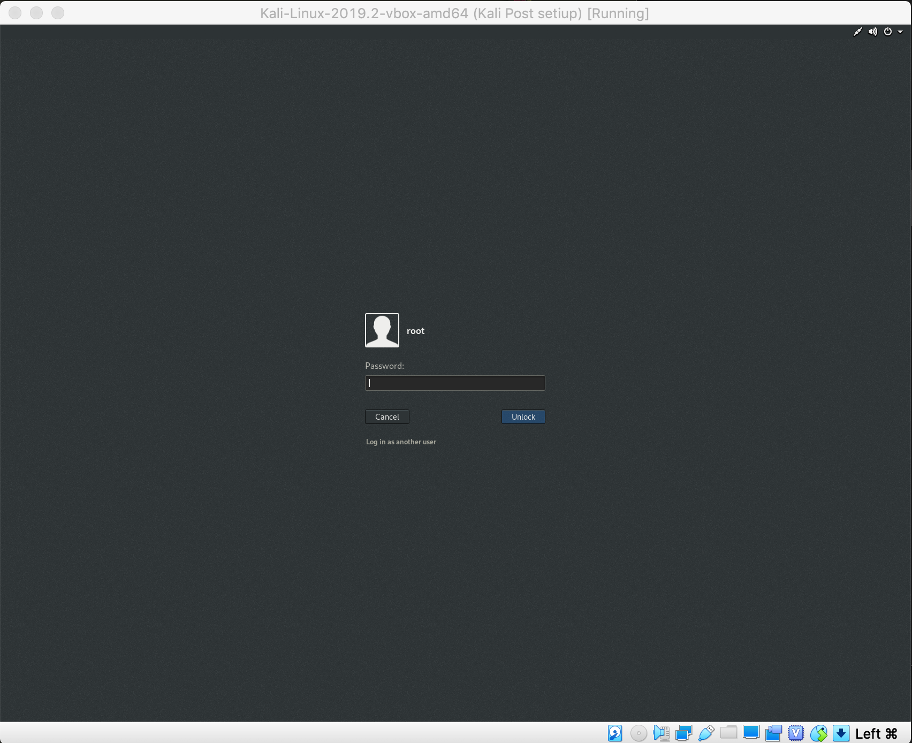

Login under the root.  The password is toor.

Open a terminal window.


Type in the command:

`ip addr show eth0`


Note that the inet address.  It should look like 10.13.13.101/24 (Your IP might be slightly different- it could end with the number 102 or 103.  That’s ok).  

The first part (10.13.13.101) is your kali linux system’s IP address.  The second part (/24) tells you the subnet range.  This means that the subnet is 10.13.13, and the host address is .101.  We want to find the ip address of the MrRobot server- so we’re going to scan the 10.13.13.0/24 subnet range to get a list of all hosts that are listening.

!!! question "Can I scan systems on the internet?"

    **You should never scan any systems on the internet without permission**. Additionally, you need to make sure that the person who gives you permission is authorized to give you permission.  Do not scan computers at school, do not scan your friend’s home networks.  It can be perceived as a hacking attempt and could get you into trouble.  Only scan systems that you are in control of and responsible for.  In this lab- we’re giving you permission to scan these systems.


```
nmap -n 10.13.13.0/24
```


At the end of the scan, we see that 3 hosts are up.  If you look in the report for the line “nmap scan report”, you’ll see that there are 3 IP addresses that were identified:

10.13.13.100
10.13.13.101
10.13.13.102

We found our Kali system’s ip at 10.13.13.101- but we also found two additional servers in our scan one at 100 and one at 102.** (Your scan may have different IP addresses- you need to pay close attention to the results.  _You will need to write down the exact IP address found in your scan, and use it through the rest of this tutorial_.  When other commands specify an IP address, you’ll need to use the one you wrote down for the commands in the rest of this workbook.)**  The 102. address has 3 services running, so we’ll focus there because it seems like it has the most opportunity for inspection.   

!!! question "What’s a service?"
    Servers are a computers that provide a network facing service that other computers can interact with.  Services are computer programs that listen for and process network connections from other computers.  Every time you visit a web page, your phone or computer are connecting to a type of service called a “web server”, which makes a decision on whether or not to accept your request & then deliver the correct content back to your client.  There are other types of services as well- sshd allows people to remotely log into the system over an encrypted connection.  SMTP servers are used for storing, sending & receiving email.  Your computer can run services that other people can connect to (e.g. if you host a minecraft game on your local network, you are temporarily running a server.  If you use a minecraft realm, instead of running the server locally- you’re running the server on a system somewhere out on the internet.  Services are interesting for hackers- they present a possible entry point, if someone made mistakes configuring the server, or if the server has exploitable mistakes in it’s code. 

## Finding the first key


One is an ssh service on port 22, one is an http service on port 80 and one is an https service on port 443.  Let’s try viewing the web page in a browser.

Remember the IP address.  Enter in the address of the server that had the listening services in a web browser.  You can open a web browser by clicking here:


You’ll see a page that looks like a text terminal with a mr. robot login and a chat that says “Hello friend...”  There are several commands you can enter.  The page looks a lot like it’s “Mr Robot” related!  We must have found the right ip address for the Mr Robot server.  (**Note: Many of the web page commands won’t work- we disabled some of the content for this challenge**).

Now we need to start thinking about how to solve this challenge.  Remember our goal- we’re trying to find some clues that would help us identify a way to log into the system.  Somewhere on this web page are clues that will help us figure out the next step.  Play with the page and see if you can solve it.  If you are stuck, move to the next section for a spoiler:

**Spoiler:**
While the page is interesting, it’s mostly fun looking marketing material for the tv show Mr. Robot.  Viewing the page source won’t yield much in terms of clues.  But hidden in the pages is some material that will help you solve the challenge.  Close the browser and go back to the linux terminal.  

Our nmap output told us there is a web server running on port 80 and port 443.  Let’s use an nmap NSE script to further spider the web site for more information:

```
nmap -n -p 80 --script http-enum 10.13.13.102
```

**(note that 10.13.13.102 may not be the right ip address for your target!  use the ip you noted earlier!**  Also- make sure that you’re not entering this command in the browser- if you see a command not found message, you probably are in the browser.  Close the browser for now! :) ) 

This command will walk through the web app and try to report back any interesting files it finds.  It takes about two minutes to complete.  

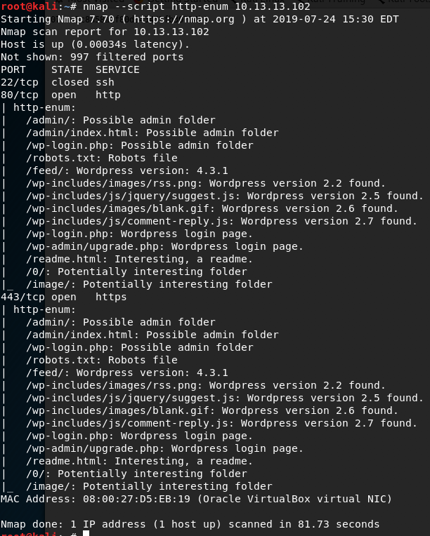

You should check out the files it offers you in a web browser, by adding the content to the existing ip address.  E.g.:

`http://10.13.13.102/readme.html`

**(note that 10.13.13.102 may not be the right ip address for your target!  use the ip you noted earlier!)**


**Spoiler**
One of the files the http-enum script highlights is the robots.txt file.

Most web pages on the Internet have a file called “robots.txt.”  If you want to keep a page from being spidered by a search engine, you can use this file to tell web crawlers to ignore your page’s content.  This “Mr Robot” page seems to be something that someone would likely want to keep off the search engine.  It’s also interesting that there’s a collision between the show’s name & this file- so let’s take a look at it.  In the browser’s address field, let’s look at the following url:

10.13.13.102/robots.txt
**(note that 10.13.13.102 may not be the right ip address for your target!  use the ip you noted earlier!)**


!!! question "What’s robots.txt??"
    robots.txt files are used to tell web search engines and web spiders some rules for crawling & indexing a page.  They are an important component that contributes to the ranking of a page for a particular piece of content in a search engine like google.  They can also be used to tell the search engine to please ignore content on the server- if for example, you wanted to keep your web page from showing up in google. 


In the robots.txt file, we see 3 lines:

* user-agent: *
* fsocity.dic
* key-1-of-3.txt

A “user-agent” is software that acts on behalf of a user- such as a web browser.  We see the *, which is a wildcard operator.  It means that this file is intended for all software connecting to the page.

The next two lines are completely non-standard for a robots.txt file.  It appears to be telling you about additional files on the web server.  Something called fsocity.dic and key-1-of-3.txt.

If we add key-1-of-3.txt to the url after the ip address (replace robots.txt)- we end up with the following page:


**You found the first CTF key!**

Congratulations!  CTFs will often have obvious indicators like this to tell you you have solved the clue.  This is a major achievement!  This would be a good stopping point if you need to take a break.  But if you’d like to continue to working on the second key, continue reading!

## Finding the second key

If we were running a jeopardy style ctf board, you’d upload the key you just found to the server.  But this is just a tutorial- so we’ll just focus on finding and reading the remaining keys.  You still have a problem: how do we log into a shell on the mr. robot system and find the remaining keys?  

**Inspecting the robots.txt entries**

Maybe the fsocity.dic entry in the robots.txt file is related.  What should we do?

Maybe this fsocity.dic is another file on the web server  Let’s browse to it and see if we find anything:


We found a file!  Let’s open it:


The file seems to be a word list.  It’s pretty hard to parse.  But there’s a clue in the extension name:  “.dic” seems like shorthand for dictionary.  There are username & password dictionaries that hackers can use to compromise a system.  Our original goal was to find a username & password combination we could use to login to the Mr.Robot shell- maybe we can use this file to perform a dictionary attack?

Reload this file in the browser.  Instead of opening it, click on save and accept the default location by clicking "ok".  (this location will be /tmp/mozilla_root0).  We’ll need that file later.

This won’t work well- if you use the wordcount command on the file, you’ll find that it has over 858 thousand lines in it.  We’re probably not ready to use this file yet.

Let’s try to get some more information about our target system.  Let’s find out more about the web server by trying to trigger an error page and look at it’s output.  There probably is not a file on the webserver named asdf.txt- so let’s browse to it and see what the error page says: 

**Exploring the web server for useful information**

Enter 10.13.13.102/asdf.txt in the address field.  
(**note that 10.13.13.102 may not be the right ip address for your target!  use the ip you noted earlier!)**

notice this error page:


At the bottom, the page says “Proudly hosted by Wordpress.”  Wordpress is a popular blogging platform that has a long history of vulnerabilities.  Maybe we can find some wordpress specific vulnerabilities to exploit?  Let’s take a note of that fact and move on.

Another possibility is to try clicking on the “log in” link (under “META”) and trying some accounts.

**Exploring login errors for useful information**

Lets’ try a username of asdf and a password of asdf and see what the error says:


The error is instructive!  it says “Error: Invalid username”. Obviously, asdf is not a valid user.  But what if we guessed a username that is likely to be on the system?  Maybe we’ll get a better answer.  

The Mr. Robot tv show has a main character named elliot.  Maybe that is a valid account on the system?  Let’s try username “elliot” and password “asdf“
This time, the error is different:

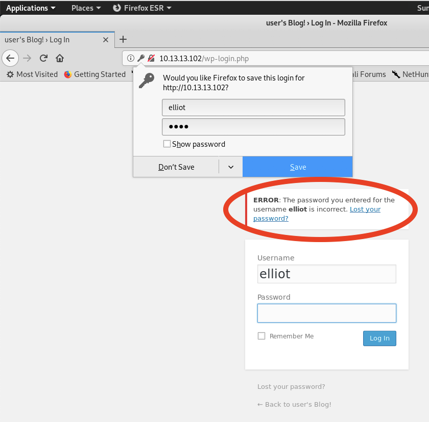

When we put asdf in the username field- we were told that the username was invalid.  When we put in elliot, we’re told we have the wrong password.  There must be a valid user named elliot!    Now we just need to guess elliot’s password.

**De-duping the password dictionary file**

That .dic file is obviously left there for us to use.  Let’s leverage the .dic file for passwords.  Since it’s so large- and many of the entries are duplicates- let’s try de-duplicating the file:

Open a new terminal, and type:

```
cd /tmp/mozilla_root0
```

```
sort /tmp/mozilla_root0/fsocity.dic | uniq -u >> fsocity_deduped.dic
```

if we use wc -l against the deduped file, we see it’s only 10 unique lines!  A much smaller set to work with:


Now we’re ready to use an automated tool to brute-force elliot’s password.  We’re going to hope that the dictionary file includes an appropriate password.  We’ll use a tool called “hydra” to brute force the password.  

You can watch the tool attempt to work with the ngrep command in a second terminal window:

```
ngrep -W byline “POST” port 80
```


Open a new terminal, and type:

```
cd /tmp/mozilla_root0
```

**Brute forcing the password of the user “Elliot”**

Now- we’re going to use a tool called “Hydra” with the dictionary file we downloaded earlier.  Hydra will use every line in the dictionary file as a password for the user account elliot.  This saves us from manually trying every single line of our dictionary file.  Type the following command (**note that 10.13.13.102 may not be the right ip address for your target!  use the ip you noted earlier!)**

```
hydra -l “elliot” -P fsocity_deduped.dic 10.13.13.102 http-post-form “/wp-login.php:log=^USER^&pwd=^PASS^&wp-submit=Log+In:F=is incorrect”
```

(If you see an error saying File for passwords not found, make sure to run the **sort** command from the previous page.  If the command completes and it indicates that all logins worked, it suggests you had a typo on the http-post-form target value.  Please review it for typos.) 

In the ngrep output of the other terminal, you can see the log & pwd lines that were included above.  Note that for every request, the log value is the same (elliot) but the password changes- it’s one of the 10 entries in the dictionary file.

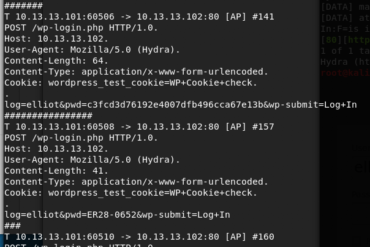

After a few moments, hydra will finish running.  If everything worked correctly, you should have the credential:


So now, if we go back into the wp login and submit the username of `elliot` & password of `ER28-0652`, we should be able to login: 

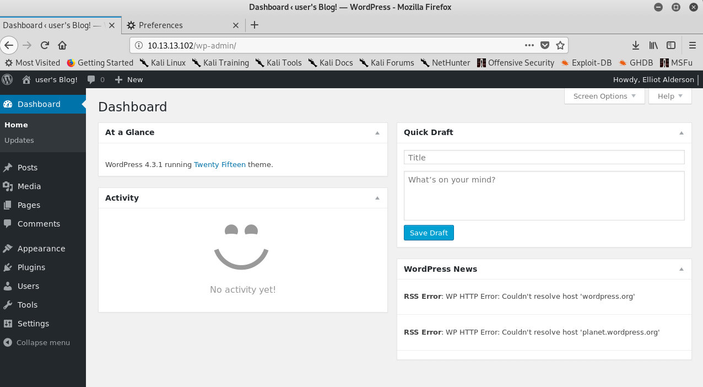

Success!  Although it’s pretty boring at this point.  There’s not much in the wp-admin page that’s of use.  We still need to get extensive access to the system.  Fortunately- we’ve gotten far enough along that we should be able to succeed. 

Remember before when we mentioned that wordpress has a long history of vulnerabilities?  We’re going to use our knowledge of elliot’s wordpress username & password to gain access to the system and find the next key.

**Using Wordpress Credentials to get a shell on a vulnerable wordpress instance**

There is an exploitation framework called metasploit which includes large numbers of methods for compromising systems.  Open up a terminal and type msfconsole:
`msfconsole`

Next, we’ll load a wordpress adminshell exploit:

```
use exploit/unix/webapp/wp_admin_shell_upload
```

you can learn more about the exploit by using the info command:

```
exploit(unix/webapp/wp_Admin_shell_upload) > info
```


We see that if we provide valid admin credentials, we’ll be able get a payload onto a server that will allow us to have a shell on the system.

Let’s set it up:

We need to set our username, password, the IP address of the target system and we need to set a `WPCHECK` variable to `false` to address a small bug.  After those 4 sets are completed, if we have the right values included, we can type “exploit” to start the attack:

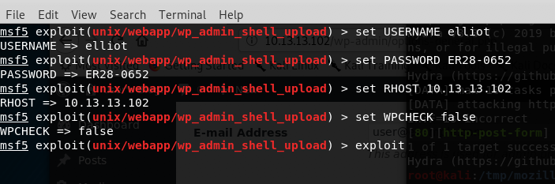

If you entered in the correct values and everything was properly online, you should see a screen like the following:


Let’s make it easy to parse shell command output by using a special python command to spawn a shell:

```
**python -c 'import pty; pty.spawn("/bin/sh")'**
```


You can now easily enter in commands.  You can use “whoami” to see the name of the account you’re currently logged into.  

```
whoami
```

This tells us that the account name we’re running under is named “daemon”

!!! question "What’s a user account?"
    Computers typically have many different types of accounts.  Some accounts have more permissions than others- while other accounts have restrictions in place that limit their functionality.  Some special accounts exist (like ftp, www, nobody, root, daemon) that are used for special purposes.  The daemon account is used by the webserver we just gained shell access through- so we are now able to run commands & access systems that the daemon account has access to. 


You can use the command pwd to see the directory you’re currently in:
 
```
pwd
```

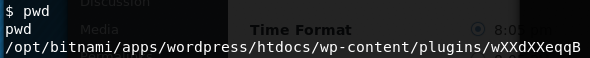

It looks like we’re in a long directory tree that hosts wordpress pages. 

Now that you’ve gained access to a unix system- it’s sometimes helpful to look around in the /home/ directory to figure out what our next step should be.  Let’s search what’s in the home directory:

```
cd /home/
```

And now let’s list the files in that directory:

```
ls -alh
```


There is a directory called “robot”- which sounds related to our CTF.  let’s look inside it:  


**You found the second CTF key!  BUT THERE’S A PROBLEM...**

Key 2 of 3 found!  Unfortunately, we cannot open it because we don’t have read permissions for it.  We’re in the daemon user, but the key is only readable by the robot user. 

Try to cat it and you’ll get the following error:

```
cat key-2-of-3.txt
```


We’re the currently running commands under the account named “daemon”- the key is readable only by the user robot. It looks like we need to look at this md5 file to get a password that will give us access to the robot account.  

Let’s try viewing it’s contents with the more command: 


The file contents are:

```
robot:c3fcd3fd76192e4007dfb496cca67e13b
```

We know that there’s an account called robot.  This file includes a line with robot, and a long string which looks similar to a hash.  The filename tells us it’s a raw-md5 document, so perhaps this long string is the hash of a password.

!!! question "What’s a hash?"

    A hash is a mathematical function that should take an input value (let’s say a), and generate exactly one unique output for that input value.  It’s kind of like a person’s fingerprint.  A fingerprint is not the person, but in theory, it could only be generated by the person who has the finger that generates that fingerprint.

Often times, secrets are “stored” using a hashing function.  This reduces the risk that someone can directly steal a password if they gain access to a system.  Modern computing and aging hashing algorithms have made it possible to quickly determine the password for a given hash.  We will use a tool called hashcat to try and find the password that generates the md5 hash “c3fcd3fd76192e4007dfb496cca67e13b”

**Cracking a password hash for the robot user account**

Open a terminal on your local Kali linux instance.  We’re going to make a file that has this hash:

Type in the following command:  

```
echo “c3fcd3fd76192e4007dfb496cca67e13b” > password.md5
```

This will create a file called password.md5, which stores the hash we found.  We need a wordlist that with commonly used passwords that we can use to generate corresponding md5 values.  Fortunately, kali has one in the /usr/share/wordlists/ directory.  We’ll use the rockyou.txt wordlist to try and find the password that generates our md5 hash.  It will create a file called “cracked.txt” which stores the hash and the corresponding password.  This command could take minutes or seconds, depending on the size of the word list and the computing power of your system:

```
hashcat --force -a 0 -m 0 password.md5 /usr/share/wordlists/rockyou.txt -o cracked.txt
```

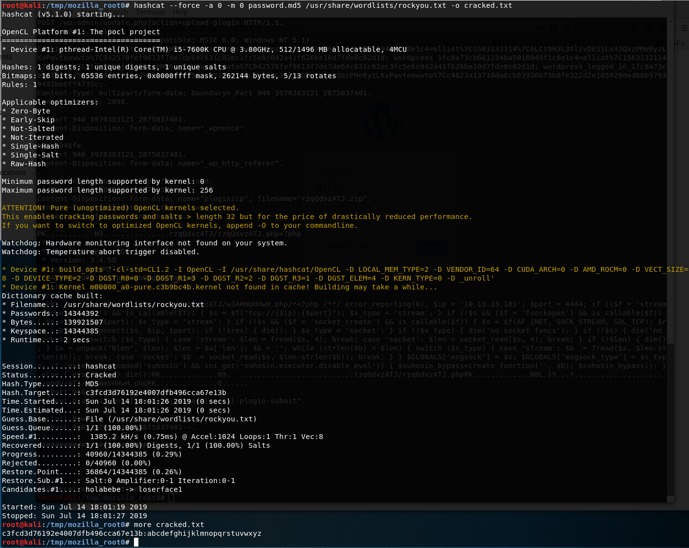

Now let’s look at our cracked.txt file.
`more cracked.txt `

This tells us that the password that generates the hash value c3fcd3d76192e4007dfb496cca67e13b is **abcdefghijklmnopqrstuvwxyz**.  We did it!  It looks like we found the password for the robot account!

You can test this hash/password value by typing the following command to get the md5 value of the password:

```
echo -n abcdefghijlkmnopqrstuvwxyz | md5sum
```

**Elevating to the robot user**

Now we just need to try and switch to the robot account.  From our metasploit shell, let’s type the following command:

```
su robot
```

You’ll be prompted for a password.  Type in `abcdefghijlkmnopqrstuvwxyz`

If you typed it in correctly, you should see the following:


Now you can view the contents of the key2-of-3.txt file:


**You finally can view the second CTF key!**

Our second key is 822c73956184f694993bede3eb39f95!  Congratulations!  Well done!   If we were competing in a CTF, we’d be uploading this value to the CTF page under our account.  If you’d like to take a break, this would be an excellent place to stop. 

## Finding the third key

2 keys down- 1 to go.  We need to find the 3rd key.  It’s probably named something like key-3-of-3.txt. Maybe we can use the find command to discover it’s location?

```
find / -name key-3-of-3.txt
```

This isn’t very productive.  We have lots of permission denied errors:


This is happening because the Robot user is not allowed to access the entire file system.  We need to elevate our privileges to be able to see what is in various directories.  We should try to get access to the root account so that we can search everywhere on the file system.

**Searching for SUID files that might be exploitable.**

One way to get root is to find a vulnerable binary on your file system that has the SUID bit set for a program that is owned by root.  This next step requires a bit of background knowledge- but let’s start out by searching for all files on the system with the setuid bit set:

```
find / -perm -4000 2>/dev/null
```

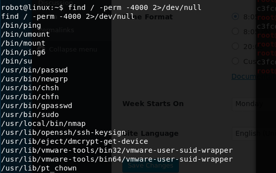

A bunch of interesting files come up - but one in particular catches my eye: the nmap comand has the setuid bit set.  You may not know this- but there used to be a version of nmap that had an interactive terminal.  If the nmap binary has the setuid bit set, and it’s owned by root, we can use it to get root.  Let’s find out who owns it:

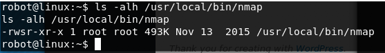

It’s owned by the root user!  Let’s call nmap using the interactive shell:

```
/usr/local/bin/nmap --interactive
```


**Exploiting an old vulnerability in NMAP to escalate to root**

If we put a ! before a command, we’ll be able to pass shell commands through nmap running under it’s setuid command.  Above, you can see the “whoami” comand doesn’t work if you skip the !, but it does work if you add it.  Not only that, but despite the fact that you invoked the nmap binary under the robot account, you’re now showing up as root.  Let’s use this trick to look inside the /root/ directory:

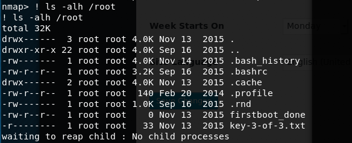

**We found key-3-of-3.txt! ** Let’s use nmap and the cat command to read it’s contents:
```
! cat /root/key-3-of-3.txt
```


**You found the final CTF key!**

We did it!  we now have the 3rd key: 04787ddef27c3dee1ee161b21670b4e4.  If we had a CTF board running, this is the key value we’d upload.  

There you go!  You have finished the lab.  Let’s review what we learned:

1. We learned about scanning a network to discover systems & their **ip addresses using nmap**
2. We found a server, and then learned how to discover **network services **running on the system, also using nmap.
3. We learned how to spider a web page and **discovered a robots.txt** file on web servers (which also happened to be our first key!) 
4. We **discovered an admin login page**, and used the error messages that the login page provided and **discovered valid user accounts** (“elliot”) on the system.
5. We used a tool called Hydra and** discovered elliot’s password**.
6. We used metasploit and **discovered vulnerabilities in the wordpress web server.**
7. We used metasploit and **gained interactive shell access to the server**.
8. We used that interactive shell access to find the second key- but we couldn’t access it due to a permissions setting.
9. We **cracked the password of the robot account** using hashcat.
10. We **used our dicovered robot account password** to view the second key.
11. We found a setuid mistake that allowed us to use an nmap binary and** escalated to the root account.**
12. We used our root privileges to find and read the 3rd key.  

There were multiple security mistakes that we exploited.
1. A password dictionary file was stored on the web server.  Putting unnecessary files on a public web server is dangerous and should be avoided.
2. Wordpress disclosed too much information about a failed login.  Error messages should not disclose information that would be useful for a hacker regarding what is happening in the web application.
3. The Wordpress version is out of date and has a known vulnerability that can be exploited to gain a shell on the service.  Software should be patched and up to date to avoid exploitable security vulnerabilities.
4. The password hash used by the robot user was not salted and consequently, vulnerable to a dictionary attack.  Passwords should be salted with instance specific secrets to reduce the effectiveness of a dictionary attack.
5. An out of date version of nmap had the SUID bit set for root, which enabled privilege escalation from the robot user.  Software should be patched and up to date.   The use of SUID for root should be generally avoided. More info on this particular mistake is available here: https://pentestlab.blog/2017/09/25/suid-executables/

## Appendix

**What are CTFs?**

Computer Security experts practice their skills in competitions called “Capture The Flag.” During the course of r00tz asylum, the neverlanCTF folks are running a CTF competition. If you’ve never competed in a CTF, it might seem intimidating- but don’t worry.  You absolutely have the skills to to try a CTF.  It’ll be intimidating as you start- but Everyone has to start somewhere. We’re here to help. 

We’re running a CTF 101 that will give you real world computer security experience. This guide will provide you with an overview of how a CTF works, and how to run through 3 real world CTF examples that are themed to align with some of the hacking events you might have seen in the TV Show "Mr. Robot” 

If you are nervous about competing in the CTF- our worklab will give you the confidence to succeed. Our examples are a little more challenging than those used in the CTF- but we give you nice guides to help you get unstuck. 

If you are interested in general computer security topics- our worklab will give you a real world example of finding & extracting secrets from working linux workstations. 

Background: 

**What is Capture the Flag?**

Capture the Flag a fun game where two teams each hide a colored flag that represents their team. The goal is to locate & take the opposing team’s flag and bring it back to their base. A typical CTF game might take 30-60 minutes and involve a lot of running around, hiding and playing “tag” to put opposing team members into jail. You get sweaty, you might get dirty. You may even get the flag and return it to your base. This is very different than a Security CTF.

**What is a Security CTF? **

In Security CTFs, we don’t run around and steal flages.  We generally don’t get sweaty outrunning our opposition.  We chase after greater adventure: We solve puzzles.  Our puzzles are about searching for secret keys in operating systems or in files.

Security CTFs come in two general types: Jeopardy & Attack-defense. Here at r00tz, neverlan is running a Jeopardy style CTF. You’ll be presented with multiple challenges worth varying amounts of points. Typically, you will be a part of a team (although you can work alone if you prefer) and all of your teammate's points will count to the final team score. The goal is for your team to have the most points at the end of the game.  You get points by finding “Keys” and submitting them to the scoring app for the competition.  A key will look similar to. (but never exactly the same) as the following:


Challenges are typically presented in the style of a Jeopardy Scoreboard- where there might be 6 columns, with each column representing a specific category of security challenges. In a given row, the value of the challenge will increase based on the complexity/difficulty of the challenge. 

You can decide which topic you think you might know the most about and then select an individual challenge. The lower value challenges are likely to be easier, and the higher value challenges are likely to be harder. The surprising thing about CTFs is that you probably know more than you realize. Sometimes the higher value challenges turn out to be easy because you just happen to know the right details. The important things to remember are: 


1. Use a search engine to research the details of a challenge (e.g. google, bing, duckduckgo, etc.) If you don’t know something, you may find answers on the Internet. 
2. Try new challenges! Don’t be afraid to walk away from one that you don’t understand. There’s always a couple of challenges that you’ll be able to solve. 
3. Take breaks! Don’t be afraid to take a break from challenges if you’re struggling. Sometimes you just need to step away from the problem- and suddenly the answers will become clear.
4. Talk to your teammates. Sometimes, describing the problem you’re having will help you identify a key detail you overlooked. Sometimes, you’ll have a special insight that will help your teammate solve a problem. 


**Security CTF Workflow**

1. Register your team. You will normally be given a url for a web page where you can submit your challenge answers under your team’s account. 
2. Select a challenge. Review the puzzle. Collect the appropriate assets to work on the challenge (log into a vm, download a file, etc.) 
3. Identify what the target of the challenge is (the puzzle should give you some description of what your objective is. Typically, you’re asked to retrieve a “key” from a file/server/etc.) 
4. Post your key to the CTF web page under your team’s account. If you submit the wrong key, the CTF web page will normally tell you that it’s the wrong value and won’t award points. If you submit the right key, you’ll get the points for your team. 
5. Keep solving challenges till the competition is over. Sometimes competitions give you a bonus for being the first team to solve a challenge- but don’t worry if someone else solves it before you. You still can get points. 


**CTF strategies:**

First- decide if you want to work alone, or form a team. **Tip**: You should form/join a team! You’ll learn things from other players. You’ll likely teach other players things they didn’t know. You’ll find that a team will collect points faster than you can as a sole contributor. Don’t be afraid to ask existing teams if they need someone to join them. 


1. **Solve challenges based on categories you’re comfortable with**

You can choose whatever problem you would like to work on out of all of the challenges based on the value of the challenge. You can also choose to work on a problem based on the category of the problem- you might be really comfortable looking at files, or capturing network packets- and so you may choose to work on problems based on their category. 


1. **Solve challenges based on score values**

Are you feeling extra confident? Go for the higher score challenges. Are you feeling lucky? Go for the higher score challenges? 
Are you feeling nervous? Go for the lower score challenges. Don’t be afraid to try categories you don’t think you know. You might be surprised to discover you know more than you expect. 


**List of Linux commands we used:**


* **ls** (used to list information about files and directories within the file system.)
* **cd**(used to change the current directory)
* **pwd** ( pwd prints the name of the present/current working directory (PWD - Present Working Directory)
* **find** (utility for walking a file hierarchy. It can be used to find files and directories and perform subsequent operations on them)
* **ip**(used to assign an address to a network interface and/or configure network interface parameters on Linux operating systems. )
* **nmap** (tool used for scanning network hosts for discovering what services the hosts are running)
* **cat** (command used to create single or multiple files, **view contain of file**, concatenate files and redirect output in terminal or files)
* **more** (similar to **cat**.  more is used to view the text files in the command prompt, displaying one screen at a time in case the file is large)
* **whoami** (used to discover the user account the shell is currently running under).
* **echo**(used to display line of text/string that are passed as an argument . This is a built in command that is mostly used in shell scripts and batch files to output status text to the screen or a file.)
**hashcat** (used to crack passwords from various hashing formats)
* **sort**(Used to sort text files)

